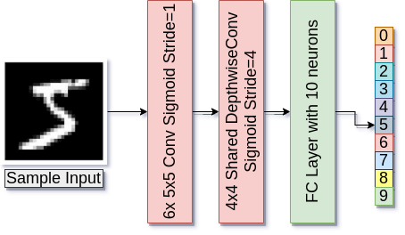
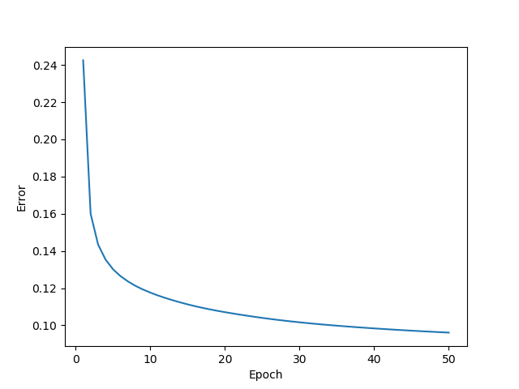
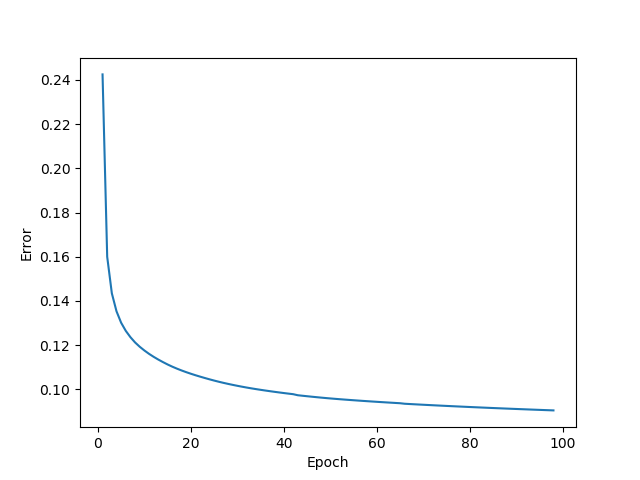
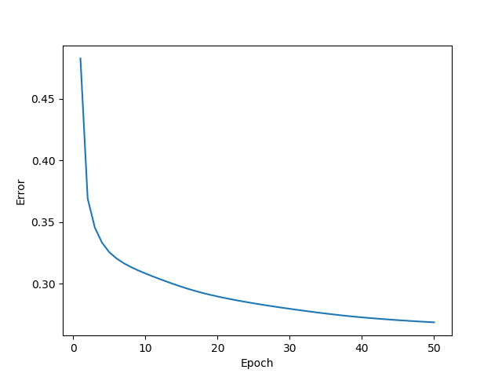

# CuCNN

A simple 3-layer CNN architecture implemented using CUDA framework.



## Code Structure

- `data/`: Contains the **testset** and **trainset** MNIST data.

- `mnist.h`: **Header** file for loading MNIST dataset. Used an existing version available [here](https://github.com/projectgalateia/mnist).

- `layer.h`: **Header** file for a layer (convolution or fully-connected) in the CNN.

- `layer.cu`: **Cuda** code for the forward and back propagation operations which are executed on the **device (GPU)** for all layers in the CNN.

- `main.cu`: Contains code for **execution of all the kernels** for training and testing of the CNN.

- `Makefile`: **make** file for compiling the code.

- `images/`: Contains images used in README.md.

## Setup

Steps to train and test the CNN on **Google Colab**.

- Mount google drive to the colab notebook:

```
from google.colab import drive
drive.mount('/content/gdrive')
```
- Navigate to Drive Space:
```
%cd /content/gdrive/My Drive/
```

- Clone the repo using:
```
! git clone https://github.com/praeclarumjj3/CuML.git
```

- Navigate to the folder of the algorithm you want to test using:
```
%cd CuML/CuCNN
```

- Compile the code using:

```
! make
```
OR
```
! nvcc -lcuda -lcublas *.cu -o CNN
```

- Run the executable using:
```
! ./CNN 
```
## Experiments

We perform experiments with two settings:

<details>
  <summary>
    Epochs = 50
  </summary>
  Total Training Time : 272.405225 seconds (4.54 minutes),
  
  Test Accuracy: 97.12%
</details>

<details>
  <summary>
    Epochs = 100
  </summary>
  Total Training Time : 546.414189 seconds (9.1 minutes),
  
  Test Accuracy: 97.41%
</details>

The experiments were performed on 60000 images present in the MNIST dataset.

**Observations:**

- Performance of the model depends on **GridSize (number of blocks in a grid/kernel)** and **BlockSize (number of threads in a block)**. 

- Products of the high order (*16<sup>th<sup> power of 2*) give inaccurate results as compared to those of *lower powers of 2*.

- As the product becomes smaller, even if accuracy remains the same, training time increases (*2<sup>8</sup> order* v/s *2<sup>12</sup> order*).

- Products of the **same order** (*power of 2*) give almost the same results (`in terms of time and accuracy`).

### Train

The losses for the two settings are:

- **Epochs = 50, Kernel = <<< 64,64 >>>**: *2<sup>12</sup> order*
    
    - Training Time: **4.54 minutes**

    

- **Epochs = 100, Kernel = <<< 64,64 >>>**: *2<sup>12</sup> order*
    
    - Training Time: **9.10 minutes**

    

- **Epochs = 50, Kernel = <<< 128,512 >>>**: *2<sup>16</sup> order*
    
    - Training Time: **4.86 minutes**

    

- **Epochs = 50, Kernel = <<< 256,256 >>>**: *2<sup>16</sup> order*
    
    - Training Time: **4.93 minutes**

    

- **Epochs = 50, Kernel = <<< 16,16 >>>**: *2<sup>8</sup> order*
    
    - Training Time: **10.02 minutes**

    

### Test

- **Epochs = 50, Kernel = <<< 64,64 >>>**: *2<sup>12</sup> order*
    
    - Accuracy: **97.12%**


- **Epochs = 100, Kernel = <<< 64,64 >>>**: *2<sup>12</sup> order*
    
    - Accuracy: **97.41%**

- **Epochs = 50, Kernel = <<< 128,512 >>>**: *2<sup>16</sup> order*
    
    - Accuracy: **87.92%**

- **Epochs = 50, Kernel = <<< 256,256 >>>**: *2<sup>16</sup> order*
    
    - Accuracy: **87.92%**

- **Epochs = 50, Kernel = <<< 16,16 >>>**: *2<sup>8</sup> order*
    
    - Accuracy: **97.12%**
