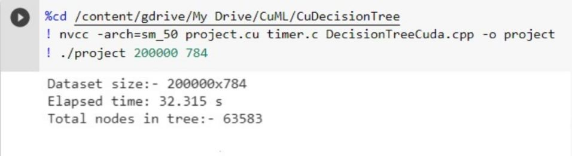

# CuDecisonTree
It contains code for Decision Tree algorithm implmented using CUDA.

## Setup
Steps to run code on **Google Colab**.
- Mount google drive to the colab notebook:
```
from google.colab import drive
drive.mount('/content/gdrive')
```

- Clone the repo using:
```
! git clone https://github.com/praeclarumjj3/CuML.git
```

- Navigate to the folder of the algorithm you want to test using:
```
%cd /content/gdrive/My Drive/CuML/CuSVD
```

- Compile the code using:
```
! nvcc -arch=sm_50 project.cu timer.c DecisionTreeCuda.cpp -o project
```

- Run the executable using:
```
! ./project 200000 784
```


